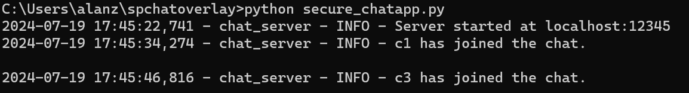
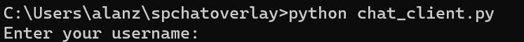
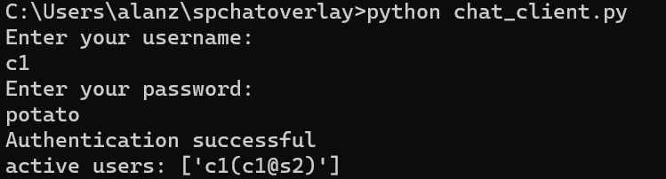
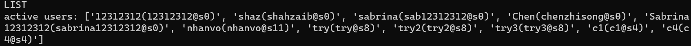
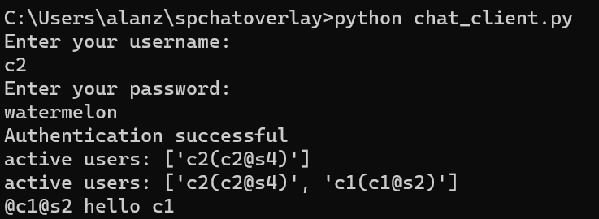
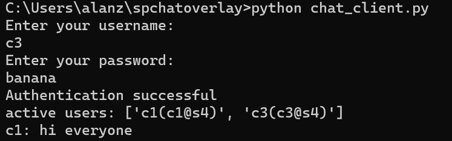

# Secure Programming Project 2024
##### Group: 4
##### Group Member: Anlan Zou, Czennen Trixter Tamayo, Yan Lok Chan, Yu-Ting Huang


## Table of Contents
- [Description](#description)
- [Installation](#installation)
- [Usage](#usage)
- [Collaboration](#collaboration)
- [License](#license)
- [Contact](#contact)
- [Acknowledgments](#acknowledgments)
- 
# Project Title

## Description
<!-- A brief description of what the project is, what it does, and why it is useful. -->
A light weight Command Line Interface chat system based on Python and websocket.
Features include:
1. Private text messaging
2. Group messaging
3. File transfer
4. End-to-end encryption

Available test user accounts:
```
passwords for c1 - c5:
1. potato
2. watermelon
3. banana
4. coconut
5. apple
```

## Installation
Step-by-step instructions on how to install and set up the project.

### Prerequisites
List any software or tools needed before installing.

### Installing
1. Step 1
2. Step 2
3. Step 3

## Usage
Enter the following command at command line terminal to (You might need to go first to the base directory that contains the Python scripts):
1. Set server and client configuration  
Edit the following options in server_config.yaml:
```
server_name: s1
chat_server:
  host: <local_ip> # same as chat_server>host in client_config.yaml
  port: <port_number> # same as chat_server>host in client_config.yaml
exchange_server:
  host: <local_ip>
  port: <port_number> #
remote_servers:
  - name: <name_of_server>
    host: <ip_addr_of_remote_server>
    port: <port_intergroup_chat>
```
Edit the following options in client_config.yaml:
```
chat_server
host: localhost
port: 12345
```
2. Start the server
Command to start the chat server:
```
python secure_chatapp.py
```


Command to start the client:
```
python chat_client.py
```


3. At the client-side terminal, follow the instructions and log in:
```
Enter your username:
(Example) c1
Enter your password:
(Example) potato
```
If login successfully, the following message will display:
```
Authentication successful!
active users: ['c1(c1@s2)]
```


4. Use LIST (uppercase only) tp check online users
```
LIST
```


4. Private Message
- Private text message to individual participant C2 on Server S2
```
@C2@S2 hello
```


- Group message to everyone in the chatroom
```
Hi everyone
```


5. File transfer
```
FILE @C2@S2 readme.md
```

6. Exit the chatroom
```
EXIT
```

## Collaboration
Thanks all the following groups for contributing to the test:
Group 1
Group 3
Group 8
Group 11
Group 13
